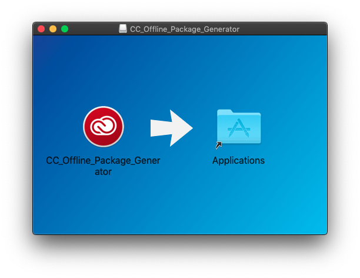
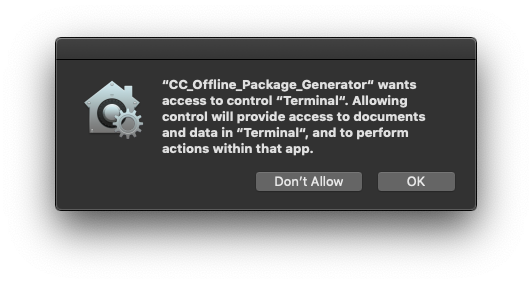
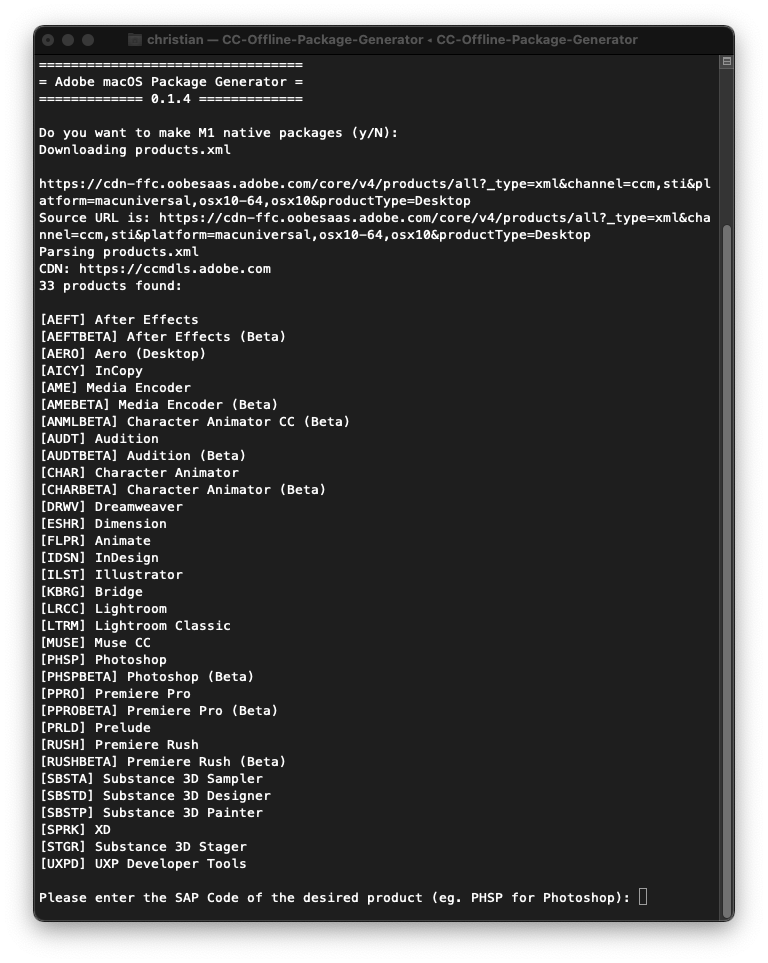
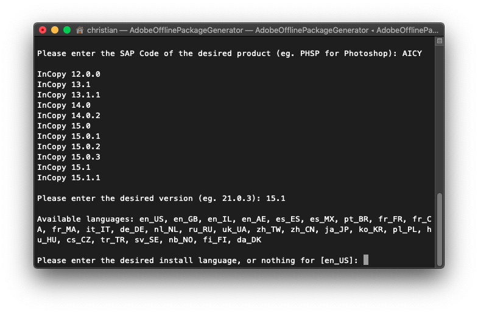
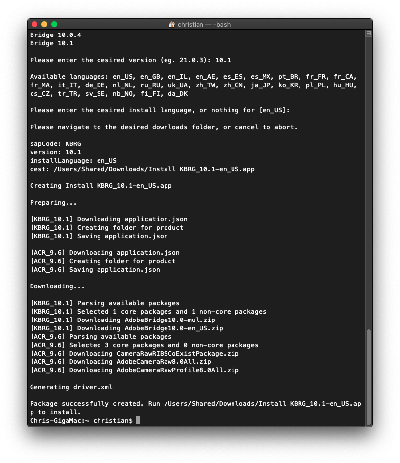
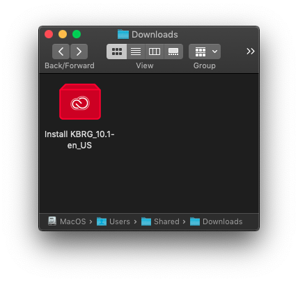
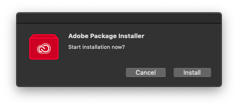
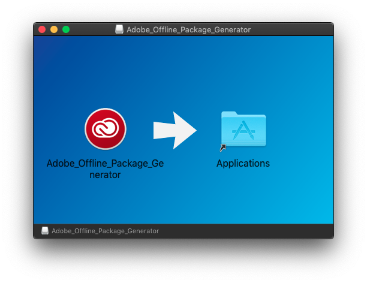
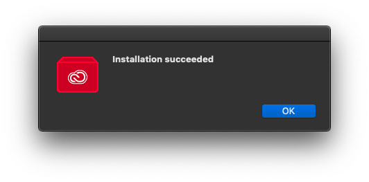

# Adobe CC 2018 to 2022 Direct Download

**UPDATE, March 11, 2022: I have released a new version of the *CC Offline Package Generator* app which packages the updated script [adobe-packager](https://github.com/Drovosek01/adobe-packager) (version 0.1.4) by Drovosek. This app will allow you to download most available versions of Adobe CC Applications on all recent versions of macOS.** The advantage of *CC Offline Package Generator* is that it already has all dependencies in a small 8 MB app, whereas the *adobe-packager* script by itself will need to download and install about 500MB of dependencies in order to work.

**Download: [CC Offline Package Generator](https://github.com/chriswayg/CC-Offline-Package-Generator/releases/latest)**

### Background

Adobe used to make Adobe CC trial full offline installer packages available via direct downloads as seen in the links for Adobe CC 2018 and 2019:

- [Adobe CC 2018 Direct Download Links](https://prodesigntools.com/adobe-cc-2018-direct-download-links.html) and [Adobe CC 2019 Direct Download Links](https://prodesigntools.com/adobe-cc-2019-direct-download-links.html)
- [How to Get New Adobe Creative Cloud 2022 Direct Download Links | ProDesignTools](https://prodesigntools.com/creative-cloud-2022-direct-download-links.html)
- [Why Direct Download Links Are Needed | ProDesignTools](https://prodesigntools.com/adobe-cc-no-more-direct-download-links.html#the-need)

There is no equivalent list of Adobe CC 2020 to 2022 direct download links available at this time, but the *CC_Offline_Package_Generator* can download the files directly from Adobe and create an installer package. *(This GitHub repository is not associated with or endorsed by Adobe or ProDesign Tools. Links to ProDesign and Adobe are provided to give additional background information on the issue of Direct Downloads of the Adobe CC offline installers and to give easy access to the various ways of downloading Adobe software.)*

### Usage

1. First download and install from Adobe the [Creative Cloud - Full Installer (250+ MB)](https://helpx.adobe.com/download-install/kb/creative-cloud-desktop-app-download.html) *(scroll down to macOS | Alternative downloads)* or if you prefer the [Creative Cloud - Installer Downloader (3+ MB)](https://creativecloud.adobe.com/apps/download/creative-cloud). The CC Offline Package Generator will not run unless the Adobe Creative Cloud app has been installed first. You need an Adobe account when installing this app.

2. Then download the [CC_Offline_Package_Generator.dmg](https://github.com/chriswayg/CC-Offline-Package-Generator/releases/), mount it and copy `CC_Offline_Package_Generator` to Applications. Run the app and it will open a Terminal window. Then follow the on-screen instructions. Tested from High Sierra up to Monterey.

Download location: https://github.com/chriswayg/CC-Offline-Package-Generator/releases/



Allow access to launch the Terminal window


The CC_Offline_Package_Generator script will download a list of all products from Adobe and prompt you to choose the product, version, language, and destination folder for the installer.




After that you just have to sit back and wait for it to finish. The script will download all required files, and then generate a convenient installer and place it in the destination directory. When prompted, select a destination folder where you want to save the installer.



Now you can run the "Install [product]" app created in the destination folder, or save it for later offline installation.



Make sure you install the [Adobe Creative Cloud App](https://creativecloud.adobe.com/apps/download/creative-cloud) first on the computers where you intend to run the installer. Most installers should work, but some will not. See *Known Issues* below for details.





### Known issues

Currently most installers work, some might not work, and some are known not to work.

- *Acrobat* does not show up in the list, as is not made available from the Adobe servers in the same way.
- Look for reports about installers that do not work in [Issues · CC-Offline-Package-Generator · GitHub](https://github.com/chriswayg/CC-Offline-Package-Generator/issues) and in [Issues · adobe-packager · GitHub](https://github.com/Drovosek01/adobe-packager/issues).

### Technical notes

The *CC_Offline_Package_Generator* binary file was built with via `pyinstaller pyinstall.spec`on macOS High Sierra 10.13.6. This means it should be compatible with High Sierra, Mojave, Catalina, Big Sur, Monterey and beyond. The python virtual environment was created with `pipenv`. The original *adobe-packager* script is in the `src/` directory. The binary already includes Python inside, so there is no need to install Python to run CC_Offline_Package_Generator. 

### Build instructions

To build the app, *Homebrew* and *Python 3* need to be installed. This has been tested with Python 3.9 from Homebrew. The `build_prerequisites.sh` script will setup everything that is required. Some familiarity with configuring Python would be helpful. - Issue the following commands in a Terminal:

```
git clone https://github.com/chriswayg/CC-Offline-Package-Generator.git
cd CC-Offline-Package-Generator
./build_prerequisites.sh
```

Open a new Terminal tab and continue with:

```
cd CC-Offline-Package-Generator
pipenv shell
./build_app.sh
```

This will produce the `CC_Offline_Package_Generator.dmg` installer in the `dmg/` directory.

---

### Alternative: run the python script

- Run a shell script which installs Homebrew and Python first (500 MB), then runs the python script.
1. Open the Apple Terminal.app
2. Copy & paste this command and hit enter:

```
/bin/bash -c "$(curl -fsSL src/install.sh)"
```

* Then run the `CC Offline Package Generator.command` in your /Applications folder and follow the on-screen instructions as explained above.

The script should be able to automatically configure itself by installing the required prerequisites in most setups: It will install Homebrew, if not already installed, then install Python 3 via Homebrew, and then add the python `requests` and the `tqdm` package to your python3 install via `pip`. These are the prerequisites for actually running the `ccdl.py` python script which does the actual download.

If you already have *Python 3*, the `requests` and the `tqdm` packages installed, you could also run  `ccdl.py` directly:

```
python3 ccdl.py
```

---

#### How this works

The developer of the script, [ayyybe](https://gist.github.com/ayyybe), explains it:

>  I used a proxy to look at how the Creative Cloud app downloads apps, and was able to emulate it. I wish it were as simple as just downloading a dmg/pkg/app but Adobe has their own proprietary installer format. All the downloads are zip files with some files, and a .pimx file, which contains instructions for the installer system (usually something like "copy these files, set these permissions on these files, register these files with the CC app"). I was originally gonna implement my own parser/installer for .pimx files and handle everything myself, but I found that you can use Adobe's own installer included in the CC app by creating and providing it with a "driver.xml" file that contains the location of all the downloads, the install location, and install language, among other things. **The installers made by this script aren't the actual offline installers that Adobe provides to its enterprise customers. They're generated by the script and contain all the downloads for the product and its dependencies, and the aforementioned driver.xml.** When you run it and click the install button, it simply runs the HyperDrive installer included with the Adobe Creative Cloud App, and points it to the driver.xml inside the Install.app

### Technical documentation

- [PyInstaller Manual](https://pyinstaller.readthedocs.io/en/stable/): *"PyInstaller builds apps are compatible with the macOS release in which you run it, and following releases."*

- [Platypus](https://sveinbjorn.org/platypus): Create Mac apps from command line scripts

- [create-dmg](https://github.com/create-dmg/create-dmg): A shell script to build fancy DMGs

### Credits and notes

- The python script was initially forked from [ayyybe/ccdl.command](https://gist.github.com/ayyybe/a5f01c6f40020f9a7bc4939beeb2df1d) with a progressbar added from jorisguex's GitHub Gist fork. After ayyybe stopped updating the script it was further developed by [SaadBazaz](https://gist.github.com/SaadBazaz/37f41fffc66efea798f19582174e654c), as well as [thpryrchn](https://gist.github.com/thpryrchn/c0ea1b6793117b00494af5f05959d526) and possibly others.
- Based on this Drovosek01 created an updated version called [adobe-packager](https://github.com/Drovosek01/adobe-packager) which forms the basis of this app. *(The currently working script version [adobe-packager](https://github.com/Drovosek01/adobe-packager) might get updated more frequently than my app.)*
- I merely created the *CC_Offline_Package_Generator* app which is the `ccdl.py` script packaged together with Python 3 using *pyinstaller* as well as adding the *.app* and *.dmg* packaging.
- *CC Folder Icon* by [Baklay](https://www.deviantart.com/baklay/gallery) and Arrow Vectors by [Vecteezy](https://www.vecteezy.com/free-vector/arrow)
- Lincense: GPL 3.0 for my portions of the code
